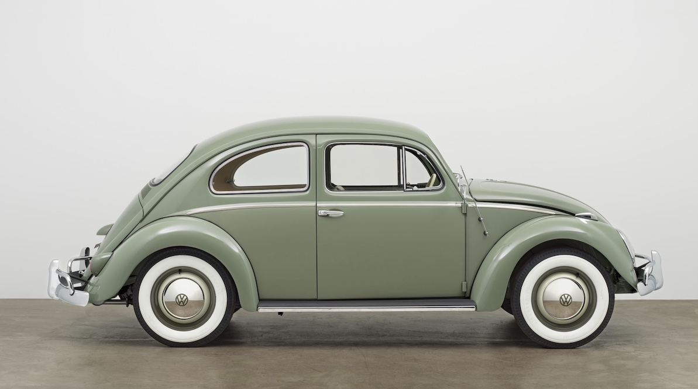
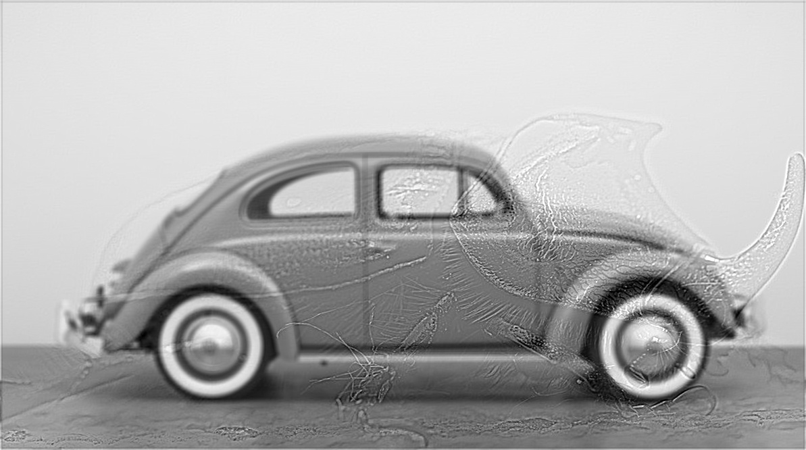

# VW "Beetle" - Hybrid Images Artifact
José Patricio Reyes Lorenzo - JR895

## Image contributing Low Frequencies

The car

## Low Pass Filter parameters
Sigma: 7

Kernel Size: 9

## Image contributing High Frequencies

The bug

## High Pass Filter parameters
Sigma: 3

Kernel Size: 7

## Mix-In Ratio
0.55

## Scale factor
2.2

## Finall Result

The VW "Beetle"

